<h1 id="title" align="center"><🌐> Poetry RESTful API</h1>

This is a web application developed with Spring Boot.

In this application you can perform the CRUD operations:
- Create
- Read
- Update
- Delete

The database used is [H2 Database][H2].

This project contains 2 subprojects:

[H2]: https://h2database.com/html/main.html

## _API Project_

Application programming interface.

The database used is [H2 Database](#delete) (in memory) in conjunction with Spring JPA.

In this API we store poems and authors.

Basic operations that can be performed (CRUD):
- [Create](#create)
- [Read](#read)
- [Update](#update)
- [Delete](#delete)

This API is protected with Spring Security so before performing any action we need to log in to the endpoint **[ /auth/login ]**.

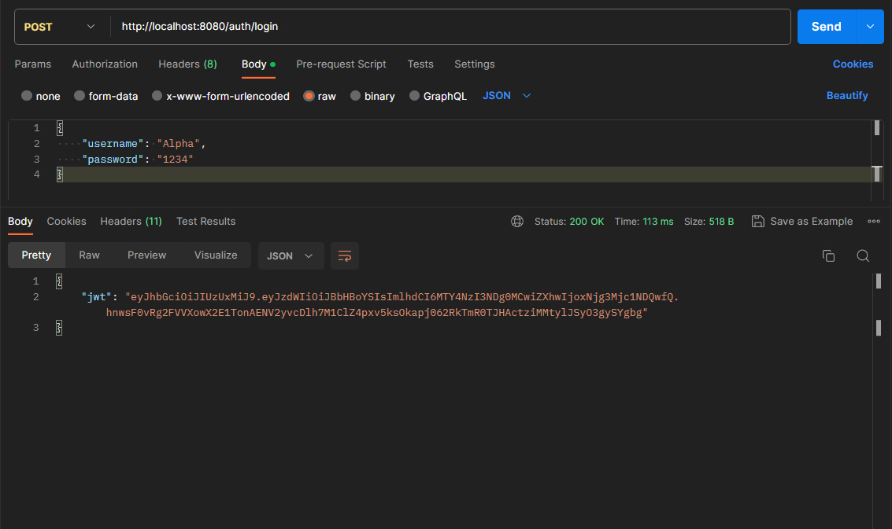

Then in all the request we want to make, we need to add the **'Authorization'** header with the given [JSON web token (JWT)](https://es.wikipedia.org/wiki/JSON_Web_Token) with the structure **'Bearer [ jwt ]'**

Requests examples:

<h3 id="read" align="center">GET ALL</h3>
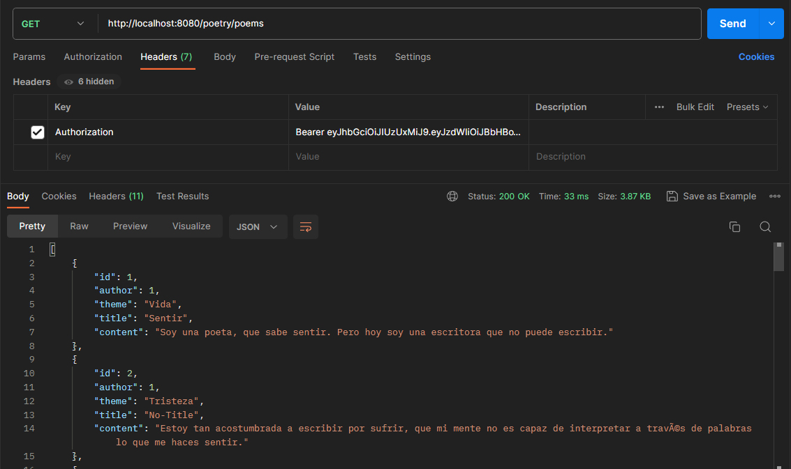

<h3 align="center">GET BY ID</h3>
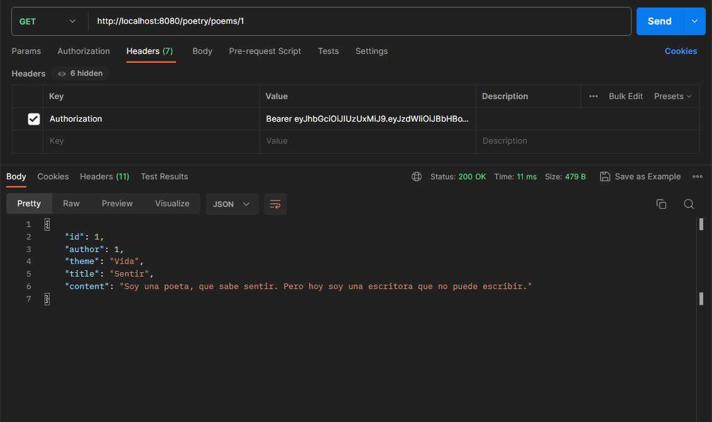

<h3 id="create" align="center">POST</h3>
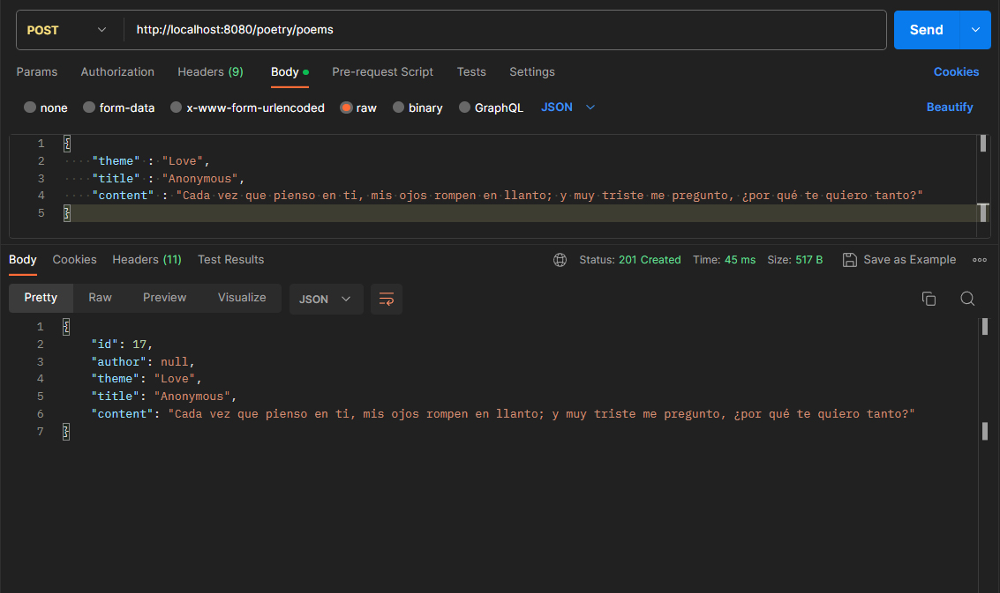

<h3 id="update" align="center">PUT</h3>
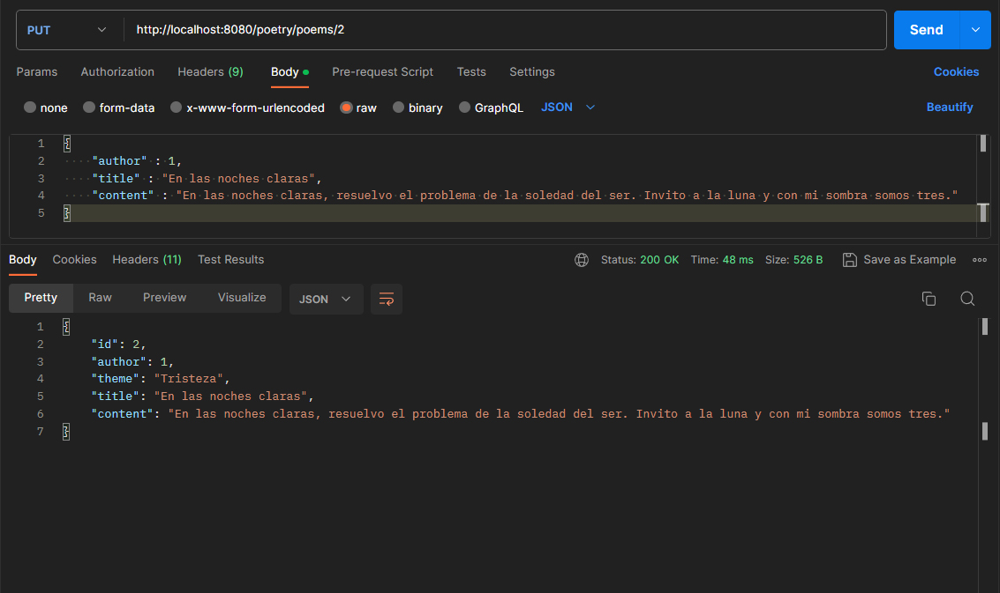

<h3 id="delete" align="center">DELETE</h3>
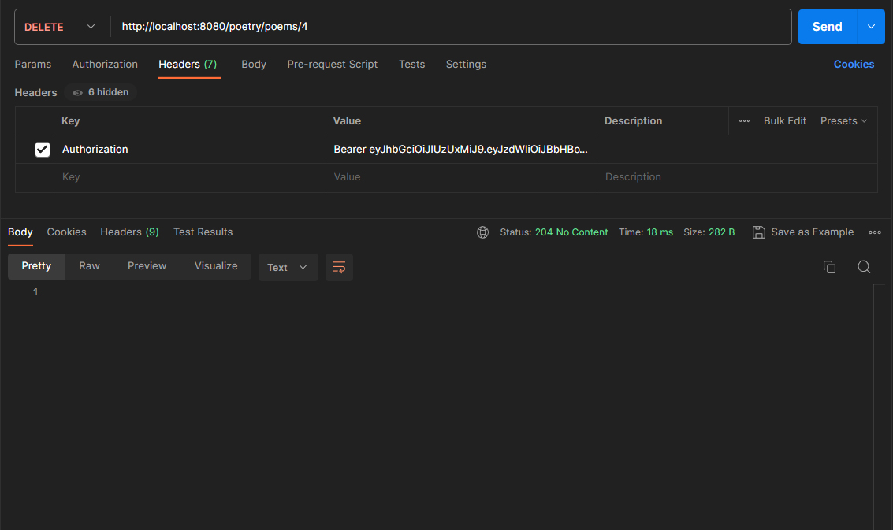

## _Client Project_

The purpose of this project is to test the API project, here we can connect to the API interactively (via console) and perform all available operations for the poem entity.

<h3 id="delete" align="center">LOGIN</h3>
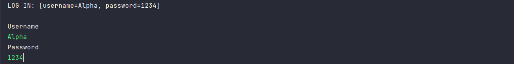

<h3 id="delete" align="center">GET BY ID</h3>
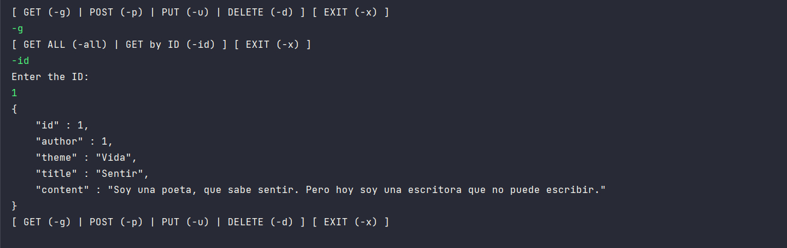

<h3 id="delete" align="center">POST</h3>
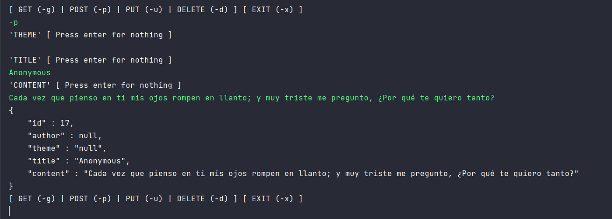

<h3 id="delete" align="center">PUT</h3>
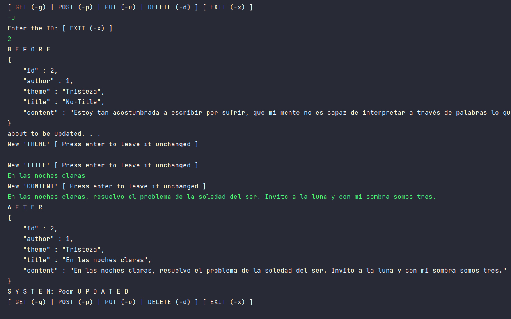

<h3 id="delete" align="center">DELETE</h3>
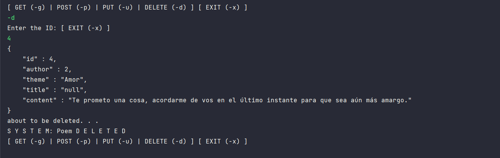

    <a href="#title">Back to top</a>

